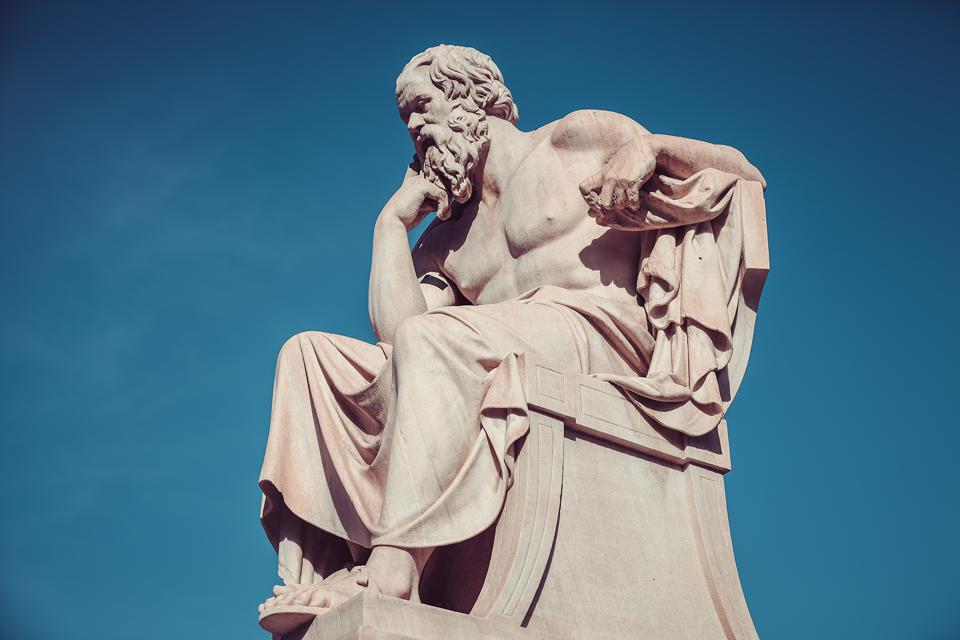
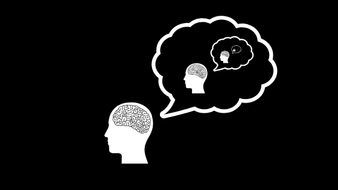

```{r setup, include=FALSE}
knitr::opts_chunk$set(echo = TRUE)
```
 

#### This report aims to discuss some interesting topics related to the history of philosophy and find out patterns among intriguing philosophical ideas brought by by scholars from different schools. Specifically, topics discussed in this reports are around various characteristics of different philosophy schools.

#### The dataset is a corrpus containing over 300,000 sentences coming from over 50 texts spanning 10 major schools of philosophy via Kaggle Database. For more detailed description, please visit [this link](https://www.kaggle.com/kouroshalizadeh/history-of-philosophy).

```{r load necessary packages, warning=FALSE, message=FALSE,echo=FALSE}
library(tm)
library(tidytext)
library(tidyverse)
library(DT)
library(wordcloud)
library(scales)
library(gridExtra)
library(ngram)
library(igraph)
library(ggplot2)
library(rsconnect)
library(ggridges)
library(Rcpp)
```

```{r read data, warning=FALSE, message=FALSE,echo=FALSE}
url<-'../data/philosophy_data.csv'
phil_data <- read.csv(url)
#head(phil_data)

#n<- nrow(phil_data)
#test <- phil_data[sample(n,n/10),] #use 1/10 of data for illustration
```

```{r generate corpus for the dataset,warning=FALSE, message=FALSE,echo=FALSE}
#necessary data cleaning & transformation
corpus <- VCorpus(VectorSource(phil_data$lemmatized_str))%>%
  tm_map(content_transformer(tolower))%>%
  tm_map(removePunctuation)%>%
  tm_map(removeNumbers)%>%
  tm_map(removeWords, character(0))%>%
  tm_map(stripWhitespace)
```

```{r generate list of stopwords,warning=FALSE, message=FALSE,echo=FALSE}
data(stop_words)
word <- c('also', 'something', 'cf', 'thus', 'two', 'now', 'would', 'make', 'eb', 'u', 'well', 'even', 'eg', 'us', 'n', 'sein', 'e', 'da', 'therefore', 'thou','however', 'would', 'thing', 'must', 'merely', 'way', 'since', 'latter', 'first','b', 'mean', 'upon', 'yet', 'cannot', 'c', 'ie', 'f', 'l', 'hyl', 'phil', 'one', 'press', 'cent', 'place','pron')
stop_words <- stop_words %>%
  bind_rows(mutate(tibble(word), lexicon = "updated"))
```


```{r tidy dictionary,warning=FALSE, message=FALSE,echo=FALSE}
completed <- tidy(corpus) %>%
  select(text) %>%
  mutate(id = row_number()) %>%
  unnest_tokens(dictionary, text)%>%
  anti_join(stop_words, by = c("dictionary" = "word"))
```

```{r sum useful words by row,warning=FALSE, message=FALSE,echo=FALSE}
completed <- completed %>%
  group_by(id) %>%
  summarise(text = str_c(dictionary, collapse = " ")) %>%
  ungroup()
```

```{r clean original data, warning=FALSE, message=FALSE,echo=FALSE}
phil_data <- phil_data %>%
  mutate(id = row_number()) %>%
  inner_join(completed)%>%
  select(author, school,original_publication_date,corpus_edition_date,sentence_length,text)
```

```{r write out csv,warning=FALSE, message=FALSE,echo=FALSE}
write_csv(phil_data, "../output/cleaned.csv")  

```


| First, I cleaned the dataset by using the "philosophy_data.csv" in data directory and used "lemmatized_str" column that has already existed in the database. From there, I cleaned the data by turning them into lowercase text, removing number, white spaces and stop words. The cleaned version of the dataset is stored in output directory.

| In this following analysis, in order to reduce the computational burden of the project, I reduced the dataset size by randomly choose 60% of rows within the cleaned dataset and continued EDA from there.

```{r read in cleaned data,warning=FALSE, message=FALSE,echo=FALSE}
df <- read_csv("../output/cleaned.csv")
n<- nrow(df)
df <- as.data.frame(df[sample(n,n*6/10),])
```

## A bit of data exploration

| Before getting into text details, let us first get an idea of the general pattern of the development of philosophy history for different genres.

```{r ridgeplot1,warning=FALSE, message=FALSE,echo=FALSE}
df %>%
  mutate(school = fct_reorder(.f = school, .x = original_publication_date, .fun = median,.desc = T))%>%
ggplot(aes(x=original_publication_date,y=school,fill = school))+
  geom_density_ridges(scale = 2, alpha=0.5) +
  scale_y_discrete(expand = c(0.8, 0)) +
  scale_x_continuous(expand = c(0.01, 0))+
  labs(x="Year", y="Density of Publication")+
  ggtitle("Density estimation of publication from different schools over time")+
  theme(plot.title = element_text(hjust = 0.6))

```

| According to the graph above, both Plato (350 BC) and Aristotle (320 BC) have developed rather early in history and Stoicism followed right after, with a development age at approximately year 230. Yet, from 250 BC to 15th century, no significant philosophical works had been published within those 10 philosophy genres.
```{r ridgeplot2,warning=FALSE, message=FALSE,echo=FALSE}
  df %>% 
  filter(original_publication_date > 1500)%>%
  mutate(school = fct_reorder(.f = school, .x = original_publication_date, .fun = median,.desc = T))%>%
  ggplot(aes(x=original_publication_date,y=school,group = school, fill = school))+
  geom_density_ridges(scale = 3, alpha=0.8) + theme_ridges()+
  scale_y_discrete(expand = c(0.8, 0)) +
  scale_x_continuous(expand = c(0.01, 0))+
  labs(x="Year", y="Density of Publication")+
  ggtitle("Density Estimation of Publication from Different Schools Over Time")+
  theme(plot.title = element_text(hjust = 0.5))

```

| Taking a closer look from 16th century and beyond, we can see a clear pattern that illustrate the general development of each philosophy school throughout time. Another interesting thing worth noticing is that some schools, such as rationalism, nietzsche or continental, had a relatively concentrated time of publication booms, represented by clearly seperated single modes; on the other hand, for other schools, they seem to deliver ideas (publish books) throughout a relatively longer period, represented by multi-modes  ridgelines, such as German Idealism or Analytics.

| After getting a taste of the data, let's dive right into analyzing the philosophy texts...

## Question: What topics do philosophers mostly intersted in discussing? Does 10 major schools tend to focus on similar philosophical topics?

```{r generating wordcloud using entire dataset,warning=FALSE, message=FALSE,echo=FALSE}
corpus <- VCorpus(VectorSource(df$text))

dtm <- DocumentTermMatrix(corpus)
dtm <- removeSparseTerms(dtm, 0.99)

#findFreqTerms(dtm, 1000)
freq <- data.frame(sort(colSums(as.matrix(dtm)), decreasing=TRUE))
colnames(freq) <- c("freq")
wordcloud(rownames(freq), freq[,1], max.words=100,colors=brewer.pal(9,"Oranges"))
```

| It appears that the most frequently used words by most of the philosophers within the 13 studies schools tend to be interested in arguing the "forms" of things, finding the "reasons" behind phenomenons and trying to understand the "world" better through "time". This trend could also be illustrated by the barplot below.

```{r barchart with overall trend,warning=FALSE, message=FALSE,echo=FALSE}
freq %>%
  filter(freq > 5000) %>%
  mutate(word = rownames(.))%>%
  mutate(word = fct_reorder(.f = word,.x = freq, .desc = T))%>%
  ggplot(aes(word,freq)) +
  geom_bar(stat = "identity")+
  labs(x="Words", y="Frequency Used")+
  ggtitle("Most Frequently Used Words by all 10 Different Philosophy Schools")
  

```

| However, the most frequently used word might very possibly be influenced by various factors and making this result not representative. For example, if book A used up 100 pages to discuss "time"  while 10 other more thinner books from different schools tend to discuss "nature" in their content, it is possible that philosophers interests in "nature" is underestimated in barplot. We can create barplots by splitting on different schools to see if the overall "hot topics" in philosophy studies is accurate.

```{r,warning=FALSE, message=FALSE,echo=FALSE}
df_list <- split(df,df$school)
freq_list <- list()
for (i in 1:length(df_list)){
  dfi <- df_list[[i]]
  dtmi <- VCorpus(VectorSource(dfi$text))
  dtmi <- DocumentTermMatrix(dtmi)
  dtmi <- removeSparseTerms(dtmi, 0.99)
  freq <- data.frame(sort(colSums(as.matrix(dtmi)), decreasing=TRUE))
  school_name <- unique(dfi$school)
  colnames(freq) <- c(school_name)
  #store freq in freq_list
  freq_list[[i]] <- freq
}

ggbar <- list()
for (i in 1:length(freq_list)){
  freq <- freq_list[[i]]
  school_name <- colnames(freq)
  colnames(freq) <- c("freq")
  lim <- freq[6,1]
  bar <- freq %>%
  filter(freq > lim) %>%
  mutate(word = rownames(.))%>%
  mutate(word = fct_reorder(.f = word,.x = freq, .desc = F))%>%
  ggplot(aes(word,freq)) +
  geom_bar(stat = "identity")+
  labs(x="Words", y="Frequency Used")+
  ggtitle(as.character(school_name))+
  coord_flip()
  
  ggbar[[i]] <- bar
}

grid.arrange(grobs=ggbar, ncol=4)

```

| The individual plots above answer our question well enough. We can observe that some of the most common words which appear in overall philosophical works seem not to be carefully discussed within works from individual schools. For example, from our prior analysis, word "time" and "object" seem to be discussed frequently within all philosophical works. However, both of them do not seem to be centrally discussed in any specific philosophy genre. That is probably because that in each school, scholars tend to discuss those two topics with a relatively smaller portion of their focus, yet those topics are broadly discussed in every school's work. Therefore, they could be summarized as the "general topics discussed by mostly all schools". On the other hand, the high frequency of words "idea" in the overall summary might be heavily dependent on its frequent appearance in Empiricism works. To put it another way, "idea" fail to be characterized as a "general focus/topic discussed by all schools".

| Moreover, the uniqueness within each school's topic would also been discovered. Examples such as the word "price" or "god" helps to define the unique characteristics embedded within Capitalism or Rationalism. The dicussion above brings us to think about the next question.

## Question: What would be some distinctive features for each school? 

| That is, despite the most common words used by all schools, which words appear the most frequently from each school? I choose to use tf-idf (term frequency–inverse document frequency), which measures the relative importance of a word to a document. After adjusting for the weight setting, 13 wordclouds are generated regarding relative accordance.

```{r tf-idf, warning=FALSE, message=FALSE,echo=FALSE}
for (i in 1:length(df_list)){
  dfi <- df_list[[i]]
  dtmi <- VCorpus(VectorSource(dfi$text))
  dtmi <- DocumentTermMatrix(dtmi, control = list(weighting = weightTfIdf))
  dtmi <- removeSparseTerms(dtmi, 0.99)
  freq <- data.frame(sort(colSums(as.matrix(dtmi)), decreasing=TRUE))
  school_name <- unique(dfi$school)
  colnames(freq) <- c(school_name)
  #store freq in freq_list
  freq_list[[i]] <- freq
}

```

```{r wordcloud, warning=FALSE, message=FALSE,echo=FALSE}

for (i in 1:length(freq_list)){
  freq <- freq_list[[i]]
  school_name <- colnames(freq)
  colnames(freq) <- c("freq")
  layout(matrix(c(1, 2), nrow=2), heights=c(1, 4))
  par(mar=rep(0, 4))
  plot.new()
  text(x = .5, y = 0.1 ,as.character(school_name))
  wordcloud(rownames(freq), freq[,1], 
            scale=c(3,0.1), 
            max.words=60,
            random.order=FALSE,
            rot.per=0.3,
            use.r.layout=T,
            colors=brewer.pal(9,"Accent"),
            main = "Title")
}

```

| Comparing the results above with what we have in the previous question, the difference is not so obvious. Only the leading words for "Aristotle" and "Continental" has a little shuffle while for other schools, their most frequently discussed words appear to be the same, despite some little adjustment in their weights, which is represented by the words' color and font size in the word cloud.


## Question: Would the focused philosophical topic change significantly from works that under the same school but were written in different time frame?

| It is interesting to think about whether the discussion strategies, such as word choice and choosen topics, within each philosophical genre would vary through time. It is reasonable to think that scholars would most likely to use events that happened in their own time to help illustrate philosophical ideas, but would that always be the case? or can we show that within the text data analysis? 

| According to the ridgelines plot at the very first of this report, I choose to further analyze this phenomenon within Feminism and Analytic. The feature of Feminism data is obvious: it has two long-distant modes, one locating at 1792 and other locating at 1981, which the year lag between would be 190 years. On the other hand, for Analytic data, it shows a multi-mode ridgeline. In order to show contrast, I take the mode locating at 1921 and 1985, which have time lag about 50 years. I am interested in figuring out if time changes the content or the main focus for philosophical schools, if so, does the time length matter?

```{r feminism, warning=FALSE, message=FALSE,echo=FALSE}
df <- df_list[["feminism"]]
df <- df %>% 
  filter(original_publication_date==1792 | original_publication_date ==1981)
#generate a df list
fem <- split(df,df$original_publication_date) 

freq_list <- list()
for (i in 1:length(fem)){
  dfi <- fem[[i]]
  dtmi <- VCorpus(VectorSource(dfi$text))
  dtmi <- DocumentTermMatrix(dtmi, control = list(weighting = weightTfIdf))
  dtmi <- removeSparseTerms(dtmi, 0.99)
  freq <- data.frame(sort(colSums(as.matrix(dtmi)), decreasing=TRUE))
  date <- unique(dfi$original_publication_date)
  colnames(freq) <- c(date)
  #store freq in freq_list
  freq_list[[i]] <- freq
}

barlist <- list()
for (i in 1:2){
  freq <- freq_list[[i]]
  date <- colnames(freq)
  colnames(freq) <- c("freq")
  lim <- freq[8,1]
  bar <- freq %>%
  filter(freq > lim) %>%
  mutate(word = rownames(.))%>%
  mutate(word = fct_reorder(.f = word,.x = freq, .desc = T))%>%
  ggplot(aes(word,freq)) +
  geom_bar(stat = "identity")+
  labs(x="Words in Feminism Works", y="Frequency Used")+
  ggtitle(paste("Published in", as.character(date)))
  
  barlist[[i]] <- bar
}

grid.arrange(grobs=barlist, ncol=2)
```

| Intuitively, we may infer from the two bar charts above that even if the two chosen works have been nearly 200 years apart, the main central focus of Feminism work have to focus on woman (of course that is the case). This result seem to coincide with our prior observation in the overall trend discussed by Feminism scholars.
| Also, we can see that back in 1792, Feminism scholars tend to relate Feminism with broader and more general ideas, such as "mind", "virtue" or "love" whereas in later future, Feminism scholars tend to discuss feminist topic with ethnicity and race, which appear to be more radical.


```{r analytic , warning=FALSE, message=FALSE,echo=FALSE}
df <- df_list[["analytic"]]
df <- df %>% 
  filter(original_publication_date==1921 | original_publication_date ==1985)
#generate a df list
act <- split(df,df$original_publication_date) 

freq_list <- list()
for (i in 1:length(act)){
  dfi <- act[[i]]
  dtmi <- VCorpus(VectorSource(dfi$text))
  dtmi <- DocumentTermMatrix(dtmi, control = list(weighting = weightTfIdf))
  dtmi <- removeSparseTerms(dtmi, 0.99)
  freq <- data.frame(sort(colSums(as.matrix(dtmi)), decreasing=TRUE))
  date <- unique(dfi$original_publication_date)
  colnames(freq) <- c(date)
  #store freq in freq_list
  freq_list[[i]] <- freq
}

barlist <- list()
for (i in 1:2){
  freq <- freq_list[[i]]
  date <- colnames(freq)
  colnames(freq) <- c("freq")
  lim <- freq[7,1]
  bar <- freq %>%
  filter(freq > lim) %>%
  mutate(word = rownames(.))%>%
  mutate(word = fct_reorder(.f = word,.x = freq, .desc = T))%>%
  ggplot(aes(word,freq)) +
  geom_bar(stat = "identity")+
  labs(x="Words in Analytic Works", y="Frequency Used")+
  ggtitle(paste("Published in", as.character(date)))
  
  barlist[[i]] <- bar
}

grid.arrange(grobs=barlist, ncol=2)
```

| As for Analytic class, even though the time lag between the data is smaller than that of Feminism sample, it does not clearly show a definite center topic within this genre. The only thing that we can infer from the graph is that frequently used words tend to be more objective and have no obvious attitudes or polarity.

| From the sample picked above, we can generally claim that as time goes by, the topics discussed in philosophical works within each genre changes. The magnitude of that change could vary, however, depending on different schools.

 

## Conclusion
|    1. The overall focus of all philosophy genre seem to discuss "time" and "object" as their common topics throughout history.
|    2. Despite from the common topics, each school has its own focused topics.
|    3. Time lag may shift the discussion objectives within each philosophy genre.